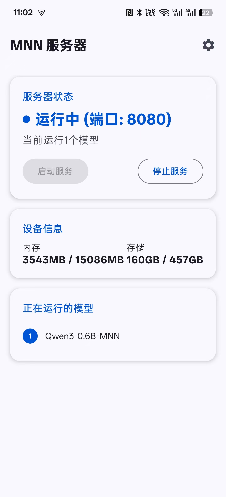
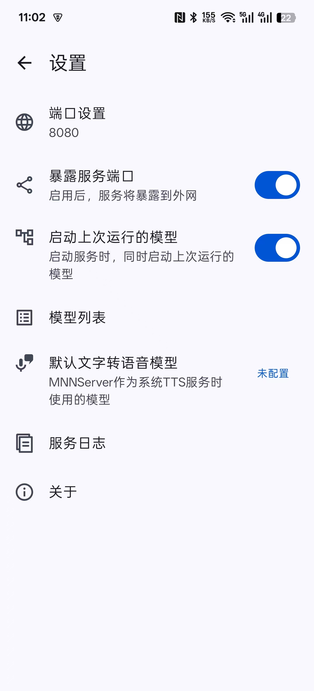
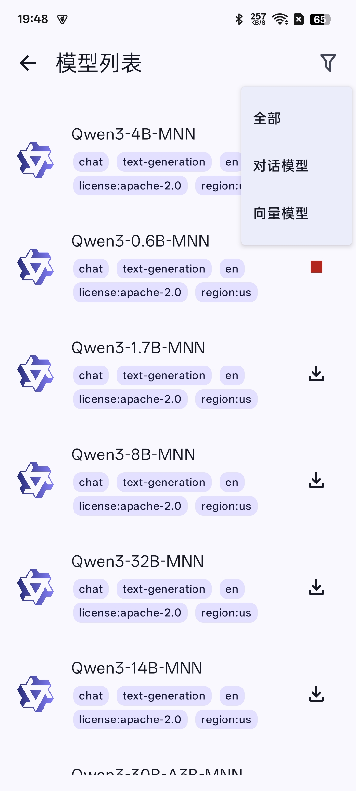

# MNN服务器

[English](./README.md)

一个支持外部调用、向量模型和语音识别模型特性的第三方MNN服务器。

# 新闻 🔥

- [2025/06/03 v0.0.3] 支持离线语音识别模型

# 截图

  
   
  

# 介绍

MNN Server是一个Android第三方MNN服务端，其可以为外部程序提供OpenAI API风格接口的MNN模型调用。MNN Server特性包括：

- 支持外部调用，可作为Android或PC应用程序的模型提供商
- 支持向量模型调用

# 快速开始

- 下载MNN Server APP
- 启动服务
- 在模型列表中下载模型并启动
- 如果需要外部设备调用，请开启“暴露服务端口”选项

# 致谢

感谢以下项目：
- **[MNN](https://github.com/alibaba/MNN)**: 没有MNN，这个项目就无法存在。
- **[mnn-asr](https://github.com/wangzhaode/mnn-asr)**

# 许可证

[LICENSE](./LICENSE)